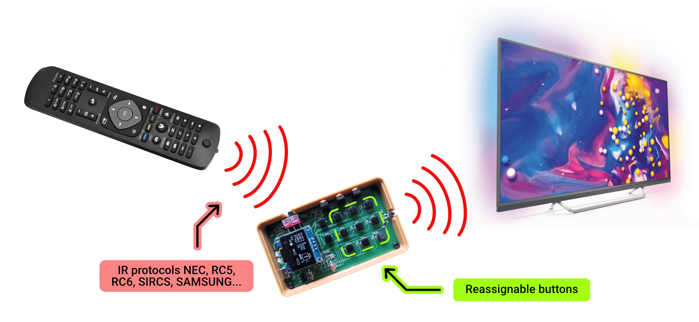
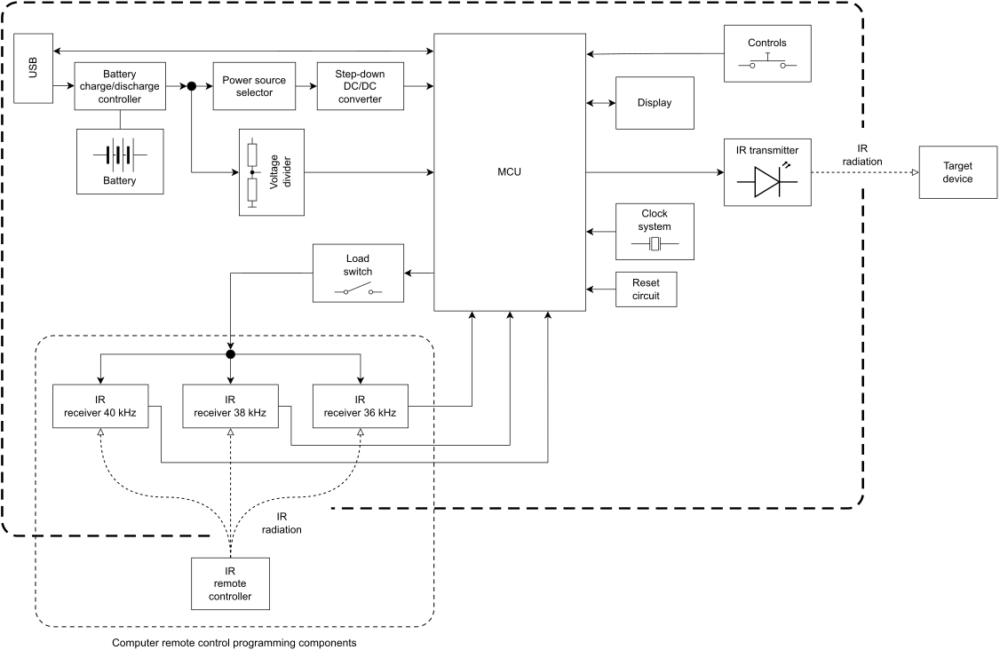
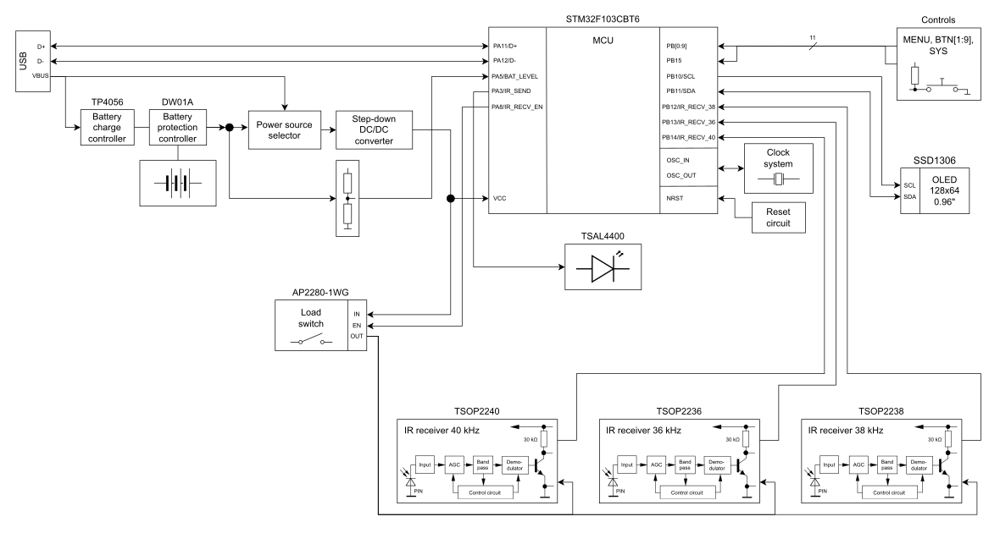
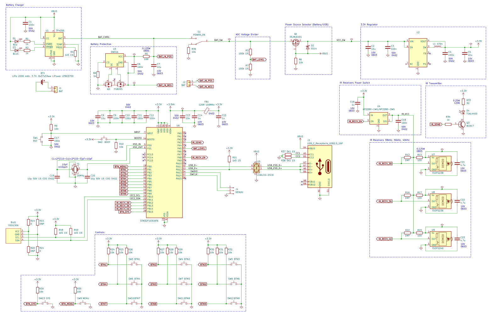
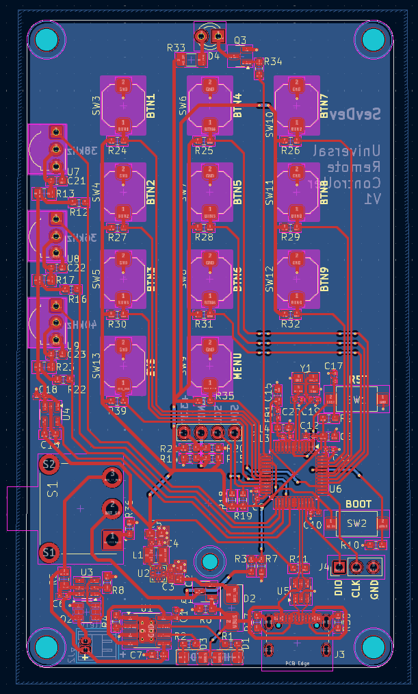
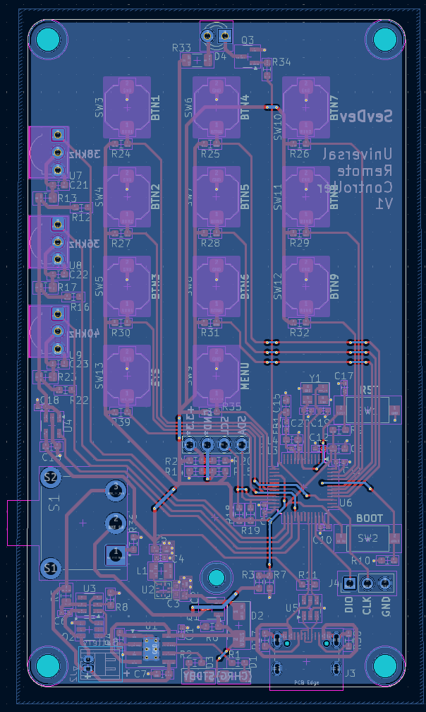
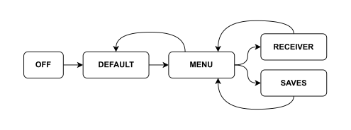
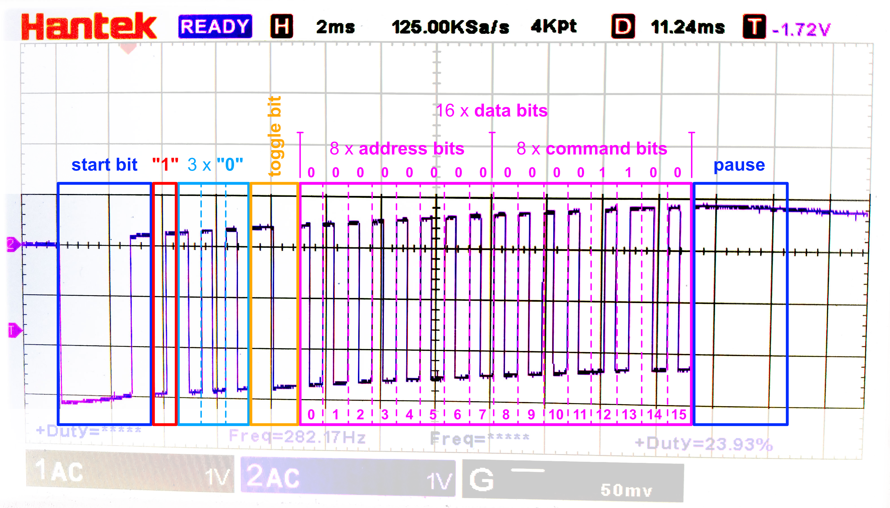

# Programmable-IR-Remote-Control
An infrared programmable computer remote control device. The device is fully portable and powered by a lithium battery. The remote control can recognize control signals using common IR protocols such as NEC, RC5, RC6, SIRCS, SAMSUNG, SAMSUNG32 and more. Recognized control codes can be assigned to appropriate general-purpose buttons.

  

### Features
- Recognition of most popular IR remote control protocols (NEC, RC6, RC5, SIRCS, SAMSUNG…) using modulation at 36, 38, 40 kHz frequencies.
- Up to 9 programmable buttons.
- Up to 10 banks of button bindings.

  

## Architecture
### Structure diagram

### Function diagram

### Circuit diagram

## Hardware
Used EDA for developing - KiCad.

### PCB
<table>
  <tr>
    <th>Top layer</th>
    <th>Bottom layer</th>
  </tr>
  <tr>
    <td></td>
    <td></td>
  </tr>
</table>

PCB 3D renders from KiCad

  

Manufactured boards

  

## Usage
The device can be in 2 main operating modes and the following states.

- Main mode:
  - Remote control ("Default" state).
- Configuration mode:
  - "Menu" state.
  - "Receiver" state
  - "Saves" state.

<table>
  <tr>
    <td></td>
    <td></td>
    <td></td>
    <td></td>
  </tr>
  <tr>
    <th>"Default"</th>
    <th>"Menu"</th>
    <th>"Receiver"</th>
    <th>"Saves"</th>
  </tr>
</table>

## Firmware
The firmware is written in STM32CubeIDE environment and using STM32CubeMX tool.

External dependencies:
- [IRMP](https://www.mikrocontroller.net/articles/IRMP_-_english)
- [IRSND](https://www.mikrocontroller.net/articles/IRSND_-_english)
- [ssd1306](https://github.com/afiskon/stm32-ssd1306)

## Tests
Some tests how it works...

  

I connected osciloscope probe to the infrared LED to see how signal is modulated (green). Demodulated signal (yellow) I pick up from infrared receiver. 

In this test IR protocol is RC6. Corresponding the modulation frequency is 36 kHz, biphase coding.

<table>
  <tr>
    <td></td>
    <td></td>
  </tr>
  <tr>
    <th>100 us/div</th>
    <th>1 ms/div</th>
  </tr>
  <tr>
    <td colspan="2"></td>
  </tr>
  <tr>
    <th colspan="2">Data frame, 2 ms/div</th>
  </tr>
</table>

## Showcase
Yes, I really needed that back case to provide a safe comfortable place for Li-poly battery. It's definitely the most dangerous part of the device:)

  

