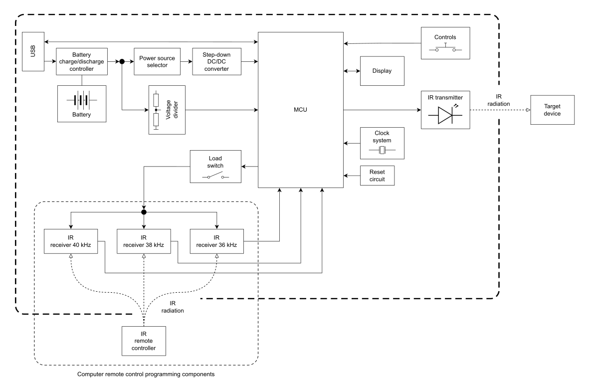

# Programmable-IR-Remote-Control
An infrared programmable computer remote control device. The device is fully portable and powered by a lithium battery. The remote control can recognize control signals using common IR protocols such as NEC, RC5, RC6, SIRCS, SAMSUNG, SAMSUNG32 and more. Recognized control codes can be assigned to appropriate general-purpose buttons.

  

## Architecture
### Structure diagram

### Function diagram

### Circuit diagram

