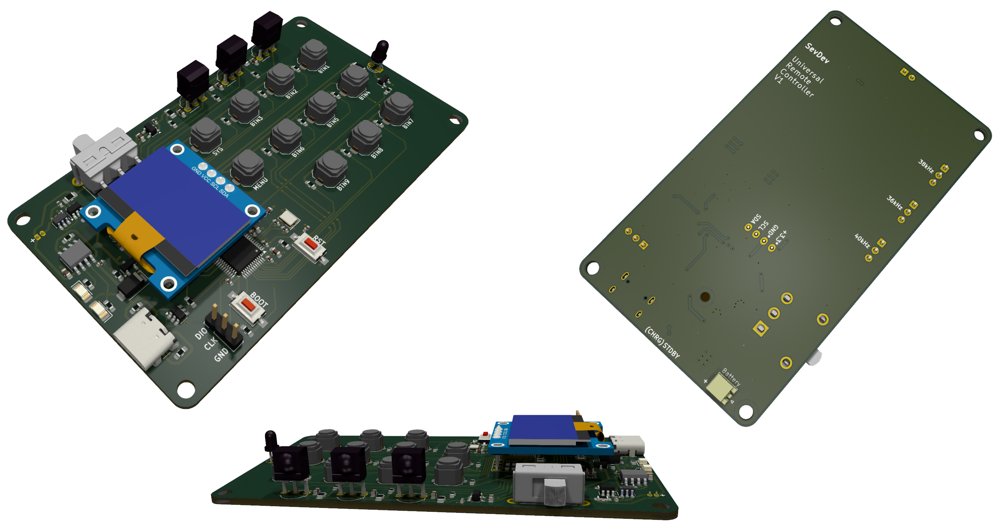

# Programmable-IR-Remote-Control
An infrared programmable computer remote control device. The device is fully portable and powered by a lithium battery. The remote control can recognize control signals using common IR protocols such as NEC, RC5, RC6, SIRCS, SAMSUNG, SAMSUNG32 and more. Recognized control codes can be assigned to appropriate general-purpose buttons.

  

## Architecture
### Structure diagram

### Function diagram

### Circuit diagram

## Hardware
### PCB
<table>
  <tr>
    <th>Top layer</th>
    <th>Bottom layer</th>
  </tr>
  <tr>
    <td></td>
    <td></td>
  </tr>
</table>

3D PCB renders from KiCad

  

Manufactured boards

## Usage
The device can be in 2 main operating modes and the following states.

- Main mode:
  - Remote control ("Default" state).
- Configuration mode:
  - "Menu" state.
  - "Receiver" state
  - "Saves" state.

<table>
  <tr>
    <td></td>
    <td></td>
    <td></td>
    <td></td>
  </tr>
  <tr>
    <th>"Default"</th>
    <th>"Menu"</th>
    <th>"Receiver"</th>
    <th>"Saves"</th>
  </tr>
</table>

## Tests
